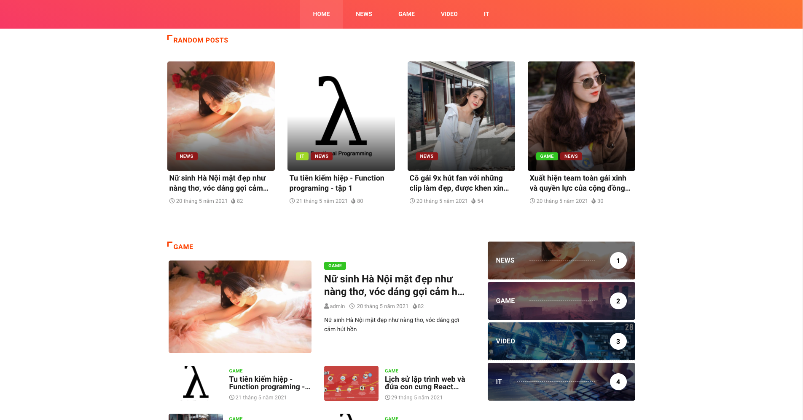
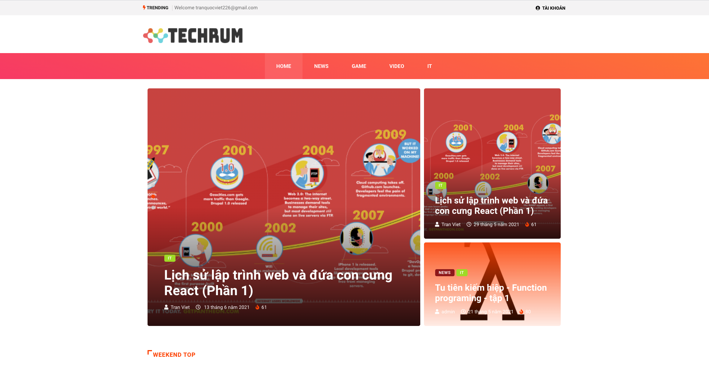

    
  

## A Developer (Android, iOS, Web, Server)   Currently learning management and working as a Javascript developer 

### Contact me
                  

 ---
 
### Skills

 

 ---

### My Website

<a style="" href="https://techrum.org">https://techrum.org</a>

|                       |                         | 
|        :---:          |          :---:          |       
|  |  | 

 ---

### Boy Scout Rule

I am interested in and talking about JavaScript, ReactJS, NestJS, and Software Engineering ♥️ 💕 

 ---
                                                                          
### More Repositories

